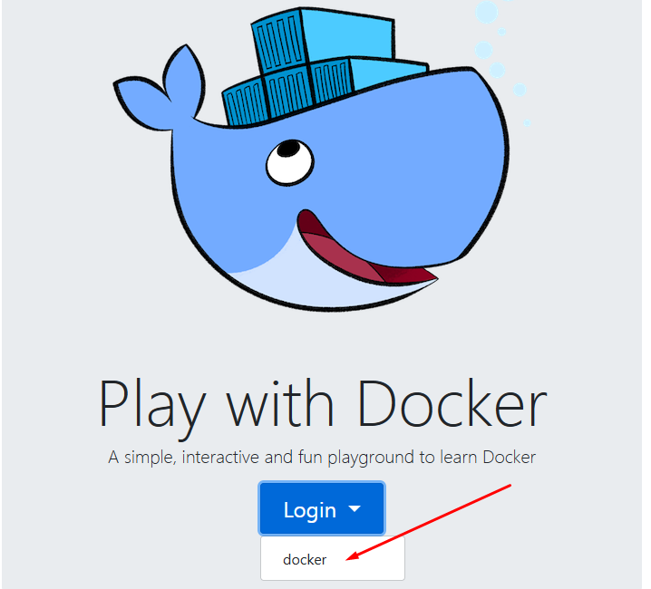

> [**Read in English**](README-en.md)

# UA-DDoS 

## Запускайте в Git bash або в [PWD](https://labs.play-with-docker.com/) (Play with docker)

Спочатку зареєструйтесь в **PWD**

[](https://labs.play-with-docker.com/)

Якщо що - пишіть <https://t.me/dirim>

Я допоможу

## Деплой

### Переходимо на сайт і натискаємо _login_ -> _docker_

Вас перекине на нове вікно



### В полі ___Docker ID___ пишемо рандомні букви-цифри (запишіть їх десь)


### Після реєстрації - ви маєте сервер!


#### Тепер ви можете валити російські сайти по повній програмі!

## Установка

```sh
git clone https://github.com/BogdanDevUA/UA-DDoS.git \
  && cd UA-DDoS \
  && . install.sh && . functions.sh
```

Цю дію треба робити тільки один раз

## Інструкція

```text
В аргуметах (наприклад ddos-ripper -s <ip>), треба писати так:

ddos-ripper -s 123.45.67.89
Не ddos-ripper -s <123.45.67.89>

Аргументи в квадратних дужках - рекомендовані параметри

Наприклад:
uashield 500 true

std - стандартизовані параметри, можна не вказувати

Наприклад:
ddos-ripper -s 123.45.67.89

Порт 80 буде автоматично вказано
Щоб вказати інший порт, допишіть -p <port>

Якщо хочеш завантажити інші програми:
load <автор> <репозиторій>

Наприклад:
load opengs uashield

Запуск uashield: uashield <потоки[500]> <проксі[true]>
Запуск MHDDoS: mhddos
Запуск DDoS-Ripper: ddos-ripper -s <ip> -p <порт[std:80]>
Запуск SPAM-EMAIL: spam-email
``` 

### Думаю все зрозуміло, тепер ти можеш дудосити російські сайти) !


## Ресурси:

* > [**uashield**](https://github.com/opengs/uashield)

* > [**MHDDoS**](https://github.com/MHProDev/MHDDoS)

* > [**DDoS-Ripper**](https://github.com/palahsu/DDoS-Ripper)

* > [**SPAM-EMAIL**](https://github.com/mkdirlove/SPAM-EMAIL)

## Чати та канали телеграм по DDoS:
* <https://t.me/UAcyberfront/9> 

* [**Cyber Hackers UA**](https://t.me/CyberHackersUA)


## Слава Україні! 
